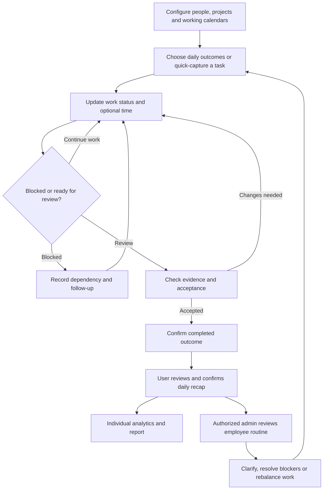

# Task Tracking and Productivity — Individual Analytics and Admin Daily Routine

**Version:** Final consolidated specification — 1 October 2026.  
**Purpose:** Planning handoff for implementation in Claude Code.  
**Scope:** Original detailed plan + all requested revisions + relevant additions from `Untitled.pdf`. This is a product specification, not an implementation-status report.

**Source mapping:** No task-specific project was identified in the PDF sections selected by the user. Task features come from the user requirements and earlier plan. Applicable shared architecture, observability and commercialization principles are adapted from pages 93, 97 and 105; they are not attributed as a task-specific PDF feature list.

## 1. Purpose

Help employees, founders and co-founders record work with minimal friction, see progress and identify blockers or overload. Give management useful delivery/capacity evidence while letting each person understand their day.

Recorded hours, attendance, mouse activity and actual productive outcomes are different measures. A system cannot reliably prove that someone used every minute well. Present work evidence and missing-data limits clearly, rather than treating an activity count as a judgment of employee worth.

## 2. Recommended low-effort operating model

Use three moments, with proposed pilot targets:

- Start of day: choose up to three intended outcomes from existing tasks, about 30 seconds.
- During work: one-click status changes, quick notes or optional timer. Collect task-linked integration events only where users know what is collected.
- End of day: review suggested completed work, add missing work/blockers and confirm the summary, about 60 seconds.

Target typical daily administrative overhead below two minutes. Treat this as a usability goal to validate, not a promise. Do not ask staff to recreate details that already exist in project tools.

## 3. Dashboards

| Workspace | What it answers |
| --- | --- |
| My Day | What matters today, what did I complete, what is blocked and how much work is planned? |
| My Analytics | Personal daily/weekly/monthly report of outcomes, time allocation, blockers, trends and recommended next steps |
| Team/Manager | Are commitments progressing, who is overloaded, where are blockers, who needs help? |
| Founder/Leadership | Which projects move business outcomes, what is late, where do resources need reallocation? |
| Admin Daily Routine | Authorized main administrator sees every employee's recorded daily task routine, then opens individual reports |
| System Administration | Roles, working calendars, integrations, visibility policies and data retention |

Founders log work under the same model. Restrict sensitive personal tasks and project data; leadership should receive the access actually needed for management.

## 4. Task design and quick capture

Mandatory at creation: a short title/outcome and owner; project defaults from context. Add due date and priority when useful, not as compulsory bureaucracy.

Optional detail: description, department, milestone, tags, effort estimate, dependencies, checklist, acceptance criteria, reviewer, evidence links, blocker and time entries. Completed tasks can require evidence/review for selected categories.

Quick-capture methods:

- Global command menu and keyboard shortcut.
- One-line text: “Prepare laptop PO draft today — 30 minutes.” Propose structured fields for confirmation.
- Short voice note/transcript as an optional feature, with explicit recording and retention settings.
- Convert a permitted approval into an execution task.
- Reuse recurring task templates for administration, finance or weekly review.
- Approved integrations suggest work from issues, commits, support tickets or calendar meetings.
- Mobile quick capture for staff away from their desks.

Avoid creating a new task for every commit, message or calendar event. Aggregate related events under the relevant outcome and ask the user to confirm ambiguous matches.

## 5. Workflow and states

1. Create or import a task with an owner and useful outcome.
2. Prioritize it within project/department commitments.
3. Select it for today when appropriate.
4. Start work or mark In Progress; time recording is optional or project-specific.
5. Mark Blocked with a reason, person needed and next follow-up.
6. Submit work/evidence for review where the task requires it.
7. Mark Done only when the acceptance criteria are satisfied.
8. At day's end confirm the personal summary; managers review exceptions and blockers.

States: Backlog, Planned, In Progress, Blocked, In Review, Done, Cancelled. Reopening preserves history and reason. Keep one accountable owner; collaborators can contribute without duplicating the outcome.

## 6. Core features

- List and Kanban views, saved filters, personal Today view and project milestones.
- Quick creation, keyboard actions, recurring tasks and sensible default fields.
- Priorities, due dates, dependencies, checklist and blocked/review states.
- Comments, evidence links and change history.
- Daily planned/actual outcomes and editable end-of-day summaries.
- Optional timer plus manual duration correction; source of each time entry remains visible.
- Review/acceptance for important deliverables and reopen/rework tracking.
- Project/department reporting, workload view and due-date risk warnings.
- Working-day, leave and capacity calendars; exclude leave/non-working time from denominators.
- Integration deduplication, sync errors and correction workflows.
- Permission-scoped search, export and management visibility.

## 7. Productivity analysis that can support decisions

| Measure | Definition/use | Limitation |
| --- | --- | --- |
| Commitment completion | Planned outcomes accepted by their due date / planned outcomes due | Tasks differ in difficulty; do not compare counts blindly |
| Delivery lead time | Time from commitment/creation to accepted completion, with definition shown | Includes waiting, dependencies and scope changes |
| Blocked time | Duration explicitly marked blocked, grouped by cause | Depends on honest status updates |
| Work in progress | Count of started, unfinished tasks | Large tasks may need milestone decomposition |
| Planned load | Estimated assigned work / available capacity | Estimates are uncertain and should show coverage |
| Logged allocation | Confirmed task/meeting/admin time by category | Missing time is unknown, not automatically unproductive |
| Rework | Reopened/rejected deliverables and reasons | Some iteration is expected in research/design |
| Business outcome | Relevant project result, such as shipped release or completed procurement | Often shared and cannot be attributed to one person exactly |

Recommended daily summary: intended outcomes, accepted outcomes, carryovers, blocker time, meeting/admin load, confirmed time coverage and next steps.

Example: 5 hours confirmed out of 7 available is 71% logging coverage, not 71% productivity. If the person shipped an important feature and resolved a critical issue, show those outcomes. A day containing research or a difficult incident may be valuable even with few closed tasks.

Avoid one universal employee productivity score or automatic low-performer rankings. If a composite is later requested, show inputs, weights, confidence and role-specific interpretation, and keep consequential decisions under human review.

## 7A. Individual Analytics Dashboard and analysis report

Every person using the product, including founders and co-founders, receives their own analysis workspace. Date controls support a specific day, week, month or custom period. Show the current day as provisional until the recap is confirmed.

Report sections:

- Day overview: available scheduled time, planned outcomes, completed/accepted outcomes, carryovers and report completeness.
- Time allocation: confirmed task work, meetings, administration, other declared work and unlogged/unknown time. Show source and conflicts.
- Delivery: on-time commitments, review status, reopened work, evidence links and actual business outcomes.
- Bottlenecks: blocker reasons, waiting dependencies and time lost to reported interruptions.
- Trends: personal delivery/capacity patterns across comparable working days, with role/project context.
- Recommendations: specific next actions such as clarify a requirement, resolve a dependency, rebalance tasks or protect a focus block.
- Correction/review: user can edit incorrect entries, explain missing context and submit the daily recap; revisions remain traceable.

Provide a readable summary and PDF/CSV report export, generated only from authorized records. Automated summaries are drafts until reviewed/confirmed where policy requires. Distinguish a user-confirmed report from a manager-reviewed report.

### Transparent time and progress metrics

| Indicator | Proposed calculation/interpretation |
| --- | --- |
| Confirmed work allocation | Non-overlapping declared task/meeting/admin time divided by scheduled available time; this is recorded allocation, not proof of productivity |
| Logging coverage | Share of available time explained by confirmed categories; remaining time is unknown |
| Planned commitment completion | Accepted planned outcomes completed / planned outcomes due, with scope changes and task context shown |
| Evidence coverage | Relevant completed outcomes with required evidence/review / outcomes requiring it |
| Blocker share | Recorded blocked time / available time, only when the data supports it |
| Capacity pressure | Estimated remaining commitments against available planned capacity, with estimate coverage |

Do not double-count imported meetings and timers. For leave/non-working days or zero-capacity periods, display Not Applicable rather than divide by zero. Distinguish an empty report from a day with no work. Missing estimates/time/evidence show their coverage; never fill them with invented values.

### Answering “Was my day productive?”

Use explainable summaries such as On Track, Needs Attention, or Insufficient Data. Each refers to configurable role/project commitments, deadline status, reported blockers and evidence, with the underlying facts visible. Avoid claiming an objective universal measure of effort.

Example: “Two of three planned outcomes accepted; one waits on a client response. Six hours recorded across task work and meetings; one hour remains unlogged. Next action: escalate the client dependency.” That tells the person and manager more than an unexplained 78/100 score.

Role-specific work matters: a founder's important negotiation, a support incident and an engineer's research should not be judged by the same closed-task count. Manager judgment and context resolve ambiguous cases.

## 7B. Main Admin Dashboard — every employee's daily routine

Give the explicitly authorized main administrator company-wide access to staff work records. This permission is separate from generic system configuration. Team managers see their assigned teams; employees see their own analytics. Include founders/co-founders when they use the same system and policy permits their visibility.

Admin overview table: employee, department/project, date, scheduled capacity, daily plan, completed/in-progress/blocked work, confirmed allocation, unlogged coverage, overdue commitments and recap status. Filter by date, employee, department, project and report status; select an employee for a detailed timeline.

Individual drill-down shows recorded task state changes, time entries by source, meetings included under the work policy, work evidence, blocker notes, corrections, day-end recap and personal trend report. The timeline is the recorded routine, not continuous surveillance or proof of every minute.

Admin actions: request clarification, add a review note, acknowledge a recap, assign a follow-up, help resolve blockers, redistribute work and export authorized daily/team reports. Notify the employee when appropriate; keep review actions visible in history. Do not silently rewrite a person's submitted work record.

Company-wide task visibility does not automatically reveal HR attachments, private calendar descriptions, passwords or every document linked to a task. Those sources retain their own access controls.

Company rollups include recap completion, backlog, overdue commitments, blocker patterns, workload concentration and declared allocation by project/department. Aggregate without ranking dissimilar roles by raw hours or task counts.

## 8. Time data and fair interpretation

- Define available capacity from working schedule, leave and agreed allocation; do not infer presence from a browser session.
- Deduplicate overlapping timers and imported calendar entries; never count a meeting twice.
- Allow correction, with audit, for forgotten timers and misclassified work.
- Show planned, confirmed and inferred time separately.
- Integration events are suggestions about work, not proof of hours spent.
- Permit honest cancellation/replanning and scope-change notes rather than rewarding easy task creation.
- Compare trends within relevant roles/projects; sales, engineering, design, operations and founders require different outcome indicators.
- Use workload and blockers to improve resource allocation and identify support needs.

This product should not include covert screenshots, keylogging, continuous microphone capture or arbitrary mouse/keyboard scoring. Any separately requested attendance/timekeeping capability needs a clearly communicated policy and its own purpose.

## 9. AI assistance and premium extensions

AI can turn short notes into task drafts, suggest next steps, summarize permitted project updates and draft daily/weekly reports. It must identify its source evidence and allow edits before official submission.

Premium features:

- Capacity planning by project and skill, with explicit allocation assumptions.
- Objectives/milestones linked to operational tasks.
- Role-specific analytics, weekly delivery reviews and trend explanations.
- Planned focus blocks and meeting-load review.
- Customer project views with tightly restricted data access.
- Project cost analysis using authorized cost rates and confirmed work allocation, with confidential salary data excluded from ordinary views.
- Configurable automation for recurring work, blocker reminders and milestone follow-ups.
- Approved issue/code/calendar/helpdesk integrations.

AI must not invent completed work, automatically certify output quality or quietly infer employee motivation from private communications.

## 10. Records and premium interface

Records: Project, Milestone, Objective, Task, TaskStateHistory, Assignment, Dependency, DailyPlan, DailyReview, TimeEntry, EvidenceLink, Blocker, WorkSchedule, CapacityAllocation, IntegrationEvent, AnalyticsSnapshot, ReportVersion, ManagerReview and AuditEvent. A report stores its period, metric definitions, source coverage, confirmation state and correction history.

Screens: My Day, quick capture, project board/list, task detail, daily recap, My Analytics, individual report, Admin Daily Routine table/timeline, team capacity, leadership delivery dashboard and integration settings. Let users update a status inline, find their next action quickly and see useful empty states. Reserve charts for decisions; the task list remains actionable.

## 11. Privacy and security

Document collected sources, visibility and retention. Restrict private projects, client evidence and rate information. Allow users to see/correct their own recorded data. Permission checks must cover source connectors and generated summaries. Avoid importing unrelated personal calendar or email content. Retain employee data only for defined purposes under the applicable policy and law.

## 12. Build phases and acceptance

| Phase | Deliverable |
| --- | --- |
| First usable release | My Day, quick capture, board/list, status history, blockers and daily review |
| Operational release | Review/evidence, optional time entries, working calendar, individual analytics/reports, Admin Daily Routine and recurring tasks |
| Assisted release | Carefully scoped integrations, deduplication and user-confirmed summaries |
| Commercial release | Tenant policies, capacity/project reporting, customer views, exports and onboarding |

Accept when users can log a routine task with one line, update it without opening a large form, correct a summary, distinguish unknown time, and see an actionable blocker. Imported duplicates do not inflate task/time counts. Leave and overlapping entries do not produce misleading capacity. Another tenant cannot see tasks, evidence or generated reports.

Analytics acceptance: every user has a personal day/week/month report; authorized main admin can view every employee's recorded day and drill down; team managers remain team-scoped; incomplete records display Insufficient Data; zero-capacity days show Not Applicable; report corrections reconcile; exports follow permissions; and private linked-source content stays restricted.

Pilot measures: median daily logging overhead, percent of users submitting useful recaps, outcome/evidence coverage, blocker age, deadline reliability and manager follow-up effort. Do not count more tasks logged as success if users spend more time administering the system.

## 13. Feature summary

Fast capture; three daily outcomes; one-click updates; optional time; confirmed daily recap; Kanban/list; evidence/review; blockers; individual Analytics Dashboard and report exports; main Admin Daily Routine with employee drill-down; capacity; leadership analytics; approved integrations; role-specific outcomes; transparent data coverage.

## PDF comparison and final merge decisions

| Topic | Earlier plan / user requirement | Selected PDF contribution | Final decision |
| --- | --- | --- | --- |
| Task-specific features | Fast logging, individual analytics and main-admin daily routine | None in selected projects 22, 23 or 25 | Retain the full user-requested task plan; do not falsely attribute it to the selected PDF |
| Approval execution | Operational task links | Request/decision/fulfillment governance from project 22 | Approved actions create scoped execution tasks with accountable owners and evidence |
| Files and identity | Evidence links and working roles | Permissioned profiles/documents from project 23 | Link authorized references; admin task visibility does not expose private files |
| Offboarding | Staff access and follow-up work | Credential rotation/offboarding from project 25 | Accept metadata-only access/rotation tasks without ever importing vault secrets |
| Shared operations | Future premium and commercial product | Tenant identity, jobs/retries, audit, observability and GTM sequence | Adapt these foundations to tasks while keeping employee metrics and product metrics separate |

## Non-negotiable user additions retained

Every user receives an individual Analytics Dashboard and day/week/month/custom analysis report. The explicitly authorized main administrator can inspect every employee's recorded daily task routine, select an individual and open their work timeline/report. Founders/co-founders who use the software are included under the declared access policy.

The routine must remain quick: reuse known tasks, one-click status updates, optional timers/manual time, approved integration suggestions and a confirmed end-of-day recap. The target of less than two minutes of daily administrative overhead must be measured with representative pilot users.

Personal reports explain completed/accepted outcomes, carried work, time allocation, unknown time, blockers, rework, deadlines and trends. An On Track/Needs Attention/Insufficient Data label must show its supporting facts and role/project assumptions. It is not a scientific measurement of every minute or a hidden employee ranking.

## Analytics specification and safeguards

| Report component | Required data and behavior |
| --- | --- |
| Available capacity | Actual configured work schedule, applicable holiday/leave and declared allocation; zero capacity is Not Applicable |
| Daily intent | Up to three planned outcomes plus commitments due, with scope changes visible |
| Accepted output | Outcomes satisfying the applicable evidence/reviewer/acceptance policy |
| Time categories | Confirmed task, meeting, administration, learning/other work; identify source and avoid overlaps |
| Unknown coverage | Unrecorded/incomplete time or estimates stay visibly unknown; do not impute idle time |
| Bottlenecks | Recorded blocked states, cause, dependency owner, waiting time and next follow-up |
| Personal trends | Compare relevant periods in the same role/project context; show coverage and definition changes |
| Admin routine | Employee/date/department/project filters, daily plan, work-state timeline, recap/review state and corrections |
| Reports/exports | Authorized PDF/CSV, period/source definitions, confirmation/review status and traceable revisions |

Show provisional versus confirmed reports. Corrections to entries must reconcile reports and exports. Model imported events separately from confirmed work/time; code commits and calendar attendance are not proof of effort or accepted outcomes.

Admin follow-up actions include clarification, visible review notes, blocker resolution, reassignment and next-action tasks. Employees can see/correct their own records; managers cannot silently overwrite submitted evidence or broaden source access.

## Integration contracts with the other four modules

- Approved purchase/hiring/payment/access requests can create execution tasks with owner, due date, approved-scope reference and completion conditions. Repeated delivery creates one intended task, not duplicates.
- A PO or offer-letter task links its reviewed/final document reference and preserves that document's confidentiality.
- Missing KYC/general documents can create scoped follow-ups using only required-item/status references.
- Offboarding and credential rotation create metadata-only tasks with secure references. No task title, note, attachment, report or AI summary contains a copied password/token.
- Calendar/issues/helpdesk integrations are opt-in and scope-limited. De-duplicate events, reconnect safely and give users visible sync/correction controls.

## Additional module-specific acceptance gates

Test one-line capture, inline updates, three-outcome planning, blocker/review/reopen behavior, optional timers/manual corrections, recurring work and daily confirmation. Measure real logging overhead rather than counting clicks in a staged demo.

Every user can open an individual period report. Main admins can inspect all authorized employee routines; team managers stay team-scoped. Report access never grants private HR, calendar or vault content access. Company/tenant boundaries hold for summaries and exports as well as task pages.

Leave/non-working periods and overlapping timer/calendar entries cannot inflate or distort capacity/coverage. Unknown data remains unknown; a missing recap differs from a confirmed no-work/non-working day. Scope changes, rework and acceptance affect the displayed indicators transparently.

The complete product includes the original plan's working calendar, optional timer, Kanban/list, recurring tasks, evidence/review, admin timeline, corrected reports, customer views and evaluated integrations. A list of manually logged minutes alone is not completion of the final productivity plan.

## Commercial expansion and durable value

Sell user/team/organization plans with clearly defined active-seat or project/workload entitlements and enterprise integrations/controls. This task pricing model is a planning adaptation, not a task-product revenue table from the selected PDF.

Use internal pilots to validate low overhead, useful reports and management follow-up. Then design partners validate roles, project styles and leave/calendar behavior before productization and distribution. Integrate adjacent office modules without making external customers buy every product.

Track product activation, useful recap adoption, median logging overhead, deadline reliability, blocker age, report correction rate, accepted-outcome evidence coverage, support effort and customer retention. Keep customer-usage/AI-cost telemetry separate from personal staff analytics. Use transparent outcome context instead of activity surveillance.

## Consolidated user flow

## Consolidated implementation foundation

This specification is self-contained for its module. The five products may be built as separately sellable applications or enabled modules in a shared office suite. The Document Generator and Approval System remain separate products connected by an explicit contract, even though PDF project 22 groups purchasing and approvals together.

### Identity, organization and authorization

- Tenant means a customer organization; companies/legal entities, branches and departments may exist inside a tenant. Every business row, storage object, search document, export, job and event must have an enforced tenant boundary.
- Shared setup includes legal company name, approved logo, contacts, addresses, registration fields when relevant, departments, managers, work calendars and module entitlements. Missing facts must remain missing until supplied.
- Roles and resource grants are explicit; sign-in, administration, decision authority and sensitive-content access are different permissions. Provide invitations, sessions, MFA where appropriate, deactivation and role/access reviews.
- Authorize on the server at the action time. Linking an item never bypasses the source's permissions. Background processing and connector calls must obey the same restrictions as the visible interface.
- Each product can run independently with stubbed development integrations clearly labelled; full integrated release must replace stubs with tested contracts. Do not force the user to deploy all five modules for one module's ordinary workflow.

### Data, jobs and integration contracts

Use a transactional relational database for business records, private object storage for blobs and a durable worker queue for long-running actions. This is an architectural default, not a mandatory vendor. Browser storage can hold UI preferences and recoverable drafts; it must not be the authoritative business store.

An integration event contains `event_id`, `event_type`, `schema_version`, `tenant_id`, `entity_id`, `resource_id`, `resource_version`, `occurred_at`, `actor_reference`, `correlation_id` and a minimized payload/reference. Receivers must authenticate the sender, recheck access, deduplicate delivery and record the result. Never include password plaintext, raw identity-document contents or unnecessary HR compensation in generic events.

Use transactional outbox or an equivalent reliable pattern for business updates that trigger jobs. Jobs have status, attempt count, retry/backoff, cancellation where safe and a dead-letter/exception queue. A timeout must not silently produce duplicate documents, decisions, files, tasks or external messages.

### Audit, observability and recovery

Record actor, tenant, resource/version, action, reason where required, time, authority, correlation and outcome. Restrict ordinary edits to audit data and maintain a separately protected archive for material actions. Define the threat boundary: application append-only rows alone are not proof against a privileged database operator. Test retention, tamper detection, export and restore reconciliation.

Observe latency, throughput, queue age, failures, cost, customer-level usage and support effort. For AI features, also record model/prompt versions and authorized evaluation/correction metrics. Sensitive values, passwords, keys and raw identity contents must not enter telemetry. Keep operational metrics separate from employee performance assessment.

Define backups, key availability, recovery-point/recovery-time objectives, clean-environment restore drills, deployment rollback and incident response. Restores must reapply access changes, deletion records and current policies.

### AI boundary

Models may propose permitted text, classifications or summaries when this module calls for them. Deterministic code owns authorization, money arithmetic, references, state transitions and completion conditions. Treat document/repository/user content as data rather than privileged instructions. Provider configuration, secret handling, data location, retention, prompt/version tracking and evaluation must be explicit. The password vault has the stricter module-specific prohibition on plaintext AI access.

### Premium design standard

A premium working dashboard must be fast, coherent and useful. Use an intentional design system with typography, spacing, color tokens, restrained status colors and consistent components. Deliver role-specific navigation, accurate counts, filters, useful empty/loading/error states, keyboard actions, responsive layouts and accessible focus/validation. Test at mobile/tablet/desktop sizes and enlarged text. Charts must display meaningful source data and explain missing coverage. Respect supplied company templates and confidential content. Do not substitute decorative animation or static demo cards for working workflows.

### Future sale and productization

The complete roadmap includes tenant onboarding, customer configuration, company branding, optional custom domains, module licences, usage limits, billing entitlements, data export, support, operational ownership and maintenance. Fundamental security and tenant isolation are included in every tier.

Follow the PDF sequence: internal use with instrumentation; then 10–30 design partners; productize onboarding/billing and recurring workflows; establish relevant distribution partners; then integrate adjacent products. Commercial pricing and the PDF's volume/revenue illustrations are hypotheses, not forecasts or approved price lists.

Track time to first value, activation, retention, expansion, realized revenue, acquisition/payback, infrastructure/AI cost, gross margin, support minutes and relevant workflow success. Track cross-sell at suite level without hiding a module's standalone value. Durable value must come from reliable workflows, reviewed customer context, permissioned history and integrations, rather than a generic AI wrapper.

## Handoff to Claude Code

This file is a final planning specification for future implementation. It does not claim that any feature has already been built. Use the paired module prompt to execute the work. The roadmap covers the full intended product; a milestone labelled first release is not permission to omit the remaining scope or report the entire plan as complete.

Before coding, map every requirement to a screen/API/data model or an explicit dependency and create a completion matrix. Keep external credentials, supplied company templates, legal/policy decisions and independent security review visible as dependencies; never fabricate them. Choose the stack after inspecting the user's actual repository and deployment requirements. Support a documented local development/run path. Cloud hosting, purchases, external sends and new account creation require the applicable authorization.

Research suitable open-source repositories as implementation candidates, not unquestioned authorities. Compare current activity, fit, licence, security posture, maintainability and operational burden. There is no assumed official global GitHub quality rank. Record selected commits, exact reused components, attribution and rejected options in a visible repository-research ledger. Inspect untrusted install scripts before execution. Respect licence obligations; do not copy incompatible code or vault cryptography casually.

A feature is complete only when its real authorized workflow, persistence, error/retry behavior and meaningful acceptance checks work. Keep samples distinct from real customer data. Maintain implementation progress and run instructions; disclose unmet dependencies instead of calling a simulation complete.
